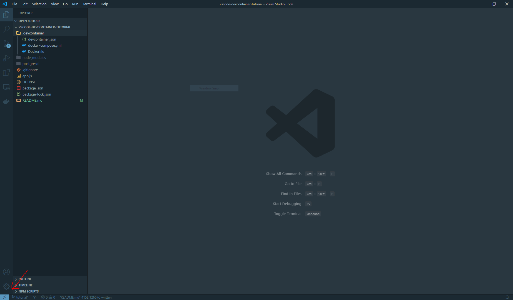
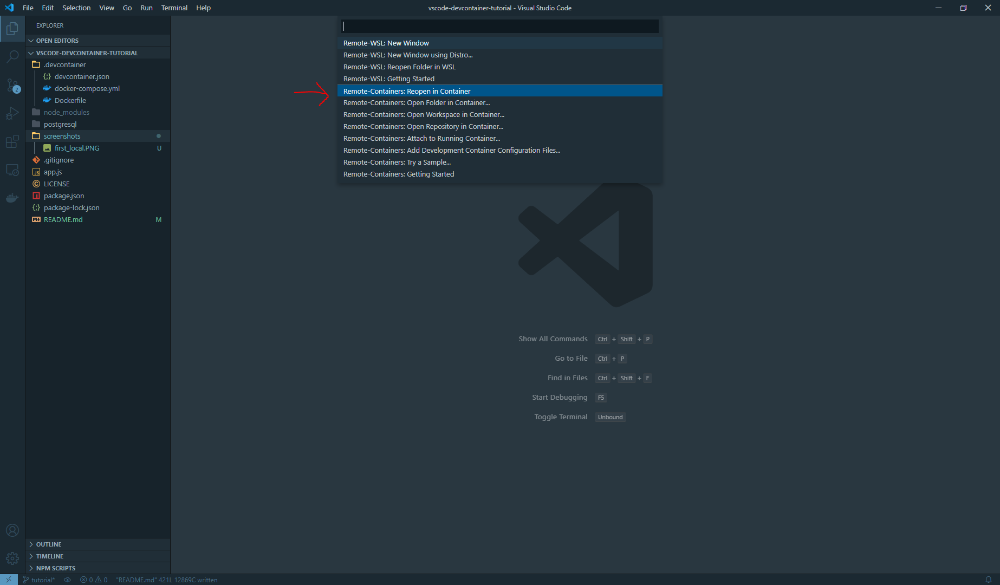
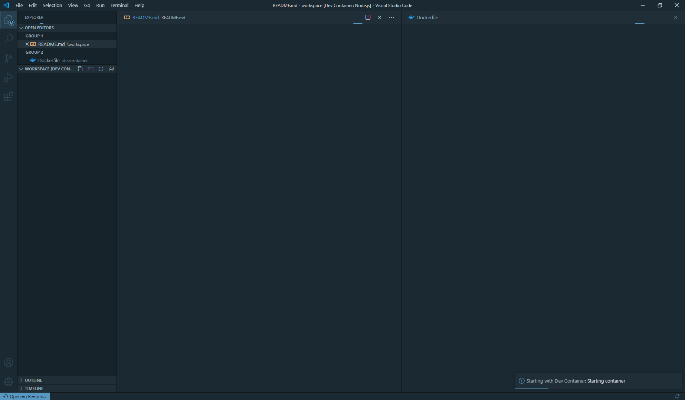

# Devcontainer  
This repo is made to explain Devcontainer

## Intro

The repo contains an express.js app connected to MongoDB

  

The app has CRUD API to an entity name “tutorial”

## Requisites
Before you jump into this tutorial,
you will need **Docker**, **Visual Studio Code**,
and **Remote - Containers** VSCode extension installed on your machine.

You can find instructions for installation here:
- Docker: <https://docs.docker.com/get-docker/>
- Visual Studio Code: <https://code.visualstudio.com/download>
- Remote - Containers: <https://marketplace.visualstudio.com/items?itemName=ms-vscode-remote.remote-containers>

  

## What is Devcontainer ?

A Development Container (or Dev Container for short) allows you to use a container as a full-featured development environment.

  

## Why Devcontainer ?

Devcontainers are awesome, we can use them to define an isolated development environment within Docker that has all that we need, and only what we need, installed in it. This helps simplify people getting into a new codebase by removing the barrier of unknown around what to setup before then can start working.

  

## How does Devcontainer work ?

A devcontainer.json file in your project tells VS Code how to access (or create) a development container with a well-defined tool and runtime stack. This container can be used to run an application or to separate tools, libraries, or runtimes required for working with a codebase.

  

# Repo Configuration
## [docker-compose.yml](.devcontainer/docker-compose.yml)
This file describes three services:
 1. **dev-container**:  That container that is used to run the express app.
 2. **mongo**: A MongoDB server
 3.  **mongo-gui**: Web-based MongoDB admin interface connected to **mongo** service

## [devcontainer.json](.devcontainer/devcontainer.json)
### Container
This file describes the development container that we are going to attach.
The container could be a:

 - Prebuilt image from docker-hub
 - Service from docker-compose
 - Dockerfile that has instructions to build  a docker image
 
In our case, the container is the service **dev-container** from docker-compose
### Extensions
This file is responsible for installing the vscode extensions needed for this project:

 1. dotenv
 2. eslint
 3. thunder-client (Postman alternative)

### Settings
This file contains the vscode settings required for this project and the extensions installed. 
In our example, we used settings to configure the extension "thunder-client".
Thunder client will automatically load and sync the [Collections](api/thunder-tests/thunderCollection.json) and [Environments](api/thunder-tests/thunderEnvironment.json) defined in "/api/thunder-tests"

### Features  
Features are self-contained units of installation code, container configuration, and/or settings and extensions designed to enable new development capabilities in your dev container.
In our example we used features to install zsh plugins (npm, node, zsh-autosuggestions...)

# Open Workspace in Dev Container

Let's try opening our workspace in a dev container.

First, start VS Code if you haven't already.
Then, select **"File > Open Folder..."** to open project root.

On the bottom left side of the window,
you can see the **"Open a remote window"** button
(the blue rectangular button on the screenshot above).
Click on it.

VS Code will open a menu like the screenshot above.
Select **"Remote-Containers: Reopen in Container"**.

It will take some time until docker images are built
& containers are started.
After a few minutes (or few seconds, depends on your machine)
VS Code will open your workspace in
the dev container.
